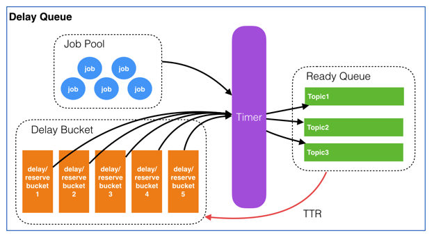

# jmq

a lightweight message queue  inspired by youzan

<!-- PROJECT SHIELDS -->

[![Contributors][contributors-shield]][contributors-url]
[![Forks][forks-shield]][forks-url]
[![Stargazers][stars-shield]][stars-url]
[![Issues][issues-shield]][issues-url]
[![MIT License][license-shield]][license-url]
[![LinkedIn][linkedin-shield]][linkedin-url]


<!-- PROJECT LOGO -->
<br />

<p align="center">
  <a href="https://github.com/shaojintian/jmq/">
    
  </a>

  <h3 align="center">Best-README-Template</h3>
  <p align="center">
    An awesome README template to jumpstart your projects!
    <br />
    <a href="https://github.com/shaojintian/jmq"><strong>Explore the docs »</strong></a>
    <br />
    <br />
    <a href="https://github.com/shaojintian/jmq"> View Demo</a>
    ·
    <a href="https://github.com/shaojintian/jmq/issues">Report Bug</a>
    ·
    <a href="https://github.com/shaojintian/jmq/issues">Request Feature</a>
  </p>

</p>

 本篇README.md面向开发者 

# 🚀 功能

- [x] 一种带有延迟功能的消息队列

<a href="https://github.com/shaojintian/jmq/">
    
</a>


## 目录

- [上手指南](#上手指南)
  - [开发前的配置要求](#开发前的配置要求)
  - [安装步骤](#安装步骤)
- [文件目录说明](#文件目录说明)
- [开发的架构](#开发的架构)
- [部署](#部署)
- [使用到的框架](#使用到的框架)
- [核心设计💡](#核心设计)
- [性能测试📊](#性能测试)
- [贡献者](#贡献者)
  - [如何参与开源项目](#如何参与开源项目)
- [版本控制](#版本控制)
- [作者](#作者)
- [赞助❤](#赞助)
- [鸣谢](#鸣谢)

### 上手指南


###### 开发前的配置要求

1. java1.8
2. springboot
3. idea

###### **安装步骤**

1. Get a free API Key at [https://example.com](https://example.com)
2. Clone the repo

```sh
git clone https://github.com/shaojintian/jmq.git
```

### 文件目录说明

eg:
/src/
```
├── /main/
│  ├── .DS_Store
│  ├── /java/
│  │  ├── .DS_Store
│  │  ├── /com/
│  │  │  ├── /sjt/
│  │  │  │  ├── /jmq/
│  │  │  │  │  ├── JmqApp.java
│  │  │  │  │  ├── /core/
│  │  │  │  │  │  ├── DelayBucket.java
│  │  │  │  │  │  ├── DelayBucketHandler.java
│  │  │  │  │  │  ├── DelayQueue.java
│  │  │  │  │  │  ├── DelayQueueJob.java
│  │  │  │  │  │  ├── DelayQueueJobPool.java
│  │  │  │  │  │  ├── ReadyQueue.java
│  │  │  │  │  │  └── ScoredSortedItem.java
│  │  │  │  │  ├── /dto/
│  │  │  │  │  ├── /exception/
│  │  │  │  │  ├── /listener/
│  │  │  │  │  │  └── ApplicationStartup.java
│  │  │  │  │  ├── /util/
│  │  │  │  │  │  └── RedissonUtil.java
│  ├── /resources/
│  │  ├── application.yaml
│  │  ├── log4j.properties
│  │  └── redis.yaml

```


### 开发的架构 

请阅读[ARCHITECTURE.md](https://github.com/shaojintian/jmq/blob/master/ARCHITECTURE.md) 查阅为该项目的架构。

### 部署

暂无

### 使用到的框架

- [Redisson](https://redisson.org/)


## 💡核心设计

数据结构
1. JobPool用来存放所有Job的元信息。
2. DelayBucket是一组以时间为维度的有序队列，用来存放所有需要延迟的Job（这里只存放Job Id）。
3. Timer负责实时扫描各个Bucket，并将delay时间大于等于当前时间的Job放入到对应的Ready Queue。
3. ReadyQueue存放处于Ready状态的Job（这里只存放JobId），以供消费程序消费。

状态转换
<a href="https://github.com/shaojintian/jmq/">
    
</a>

job生命周期

- 用户对某个商品下单，系统创建订单成功，同时往延迟队列里put一个job。job结构为：{‘topic':'orderclose’, ‘id':'ordercloseorderNoXXX’, ‘delay’:1800 ,’TTR':60 , ‘body':’XXXXXXX’}
- 延迟队列收到该job后，先往job pool中存入job信息，然后根据delay计算出绝对执行时间，并以轮询(round-robbin)的方式将job id放入某个bucket。
- timer每时每刻都在轮询各个bucket，当1800秒（30分钟）过后，检查到上面的job的执行时间到了，取得job id从job pool中获取元信息。如果这时该job处于deleted状态，则pass，继续做轮询；如果job处于非deleted状态，首先再次确认元信息中delay是否大于等于当前时间，如果满足则根据topic将job id放入对应的ready queue，然后从bucket中移除；如果不满足则重新计算delay时间，再次放入bucket，并将之前的job id从bucket中移除。
- 消费端轮询对应的topic的ready queue（这里仍然要判断该job的合理性），获取job后做自己的业务逻辑。与此同时，服务端将已经被消费端获取的job按照其设定的TTR，重新计算执行时间，并将其放入bucket。
- 消费端处理完业务后向服务端响应finish，服务端根据job id删除对应的元信息。

## 📊性能测试

 暂无


### 贡献者

请阅读**CONTRIBUTING.md** 查阅为该项目做出贡献的开发者。

#### 如何参与开源项目

贡献使开源社区成为一个学习、激励和创造的绝佳场所。你所作的任何贡献都是**非常感谢**的。

1. Fork the Project
2. Create your Feature Branch (`git checkout -b feature/AmazingFeature`)
3. Commit your Changes (`git commit -m 'Add some AmazingFeature'`)
4. Push to the Branch (`git push origin feature/AmazingFeature`)
5. Open a Pull Request


### 版本控制

该项目使用Git进行版本管理。您可以在repository参看当前可用版本。

### 作者

E-mail: sjt@hnu.edu.cn

知乎:[笃行er](https://www.zhihu.com/people/sjt_ai/activities)  &ensp; qq:1075803623    

 *您也可以在贡献者名单中参看所有参与该项目的开发者。*

### 版权说明

该项目签署了MIT 授权许可，详情请参阅 [LICENSE.txt](https://github.com/shaojintian/jmq/blob/master/LICENSE.txt)

### 鸣谢

- [有赞延迟队列设计](https://tech.youzan.com/queuing_delay/)
- [Redis 实现队列](https://segmentfault.com/a/1190000011084493)

### 赞助

If you like this project and want to sponsor the author, you can reward the author using Wechat or Alipay by scanning the following QR code.

<figure class="half">
  
  
</figure>
<!-- links -->

[your-project-path]: shaojintian/jmq
[contributors-shield]: https://img.shields.io/github/contributors/shaojintian/jmq.svg?style=flat-square
[contributors-url]: https://github.com/shaojintian/jmq/graphs/contributors
[forks-shield]: https://img.shields.io/github/forks/shaojintian/jmq.svg?style=flat-square
[forks-url]: https://github.com/shaojintian/jmq/network/members
[stars-shield]: https://img.shields.io/github/stars/shaojintian/jmq.svg?style=flat-square
[stars-url]: https://github.com/shaojintian/jmq/stargazers
[issues-shield]: https://img.shields.io/github/issues/shaojintian/jmq.svg?style=flat-square
[issues-url]: https://img.shields.io/github/issues/shaojintian/jmq.svg
[license-shield]: https://img.shields.io/github/license/shaojintian/jmq.svg?style=flat-square
[license-url]: https://github.com/shaojintian/jmq/blob/master/LICENSE.txt
[linkedin-shield]: https://img.shields.io/badge/-LinkedIn-black.svg?style=flat-square&logo=linkedin&colorB=555
[linkedin-url]: https://linkedin.com/in/shaojintian